# HOROOPLATE — Entity-Relationship Diagrams

One diagram per domain, generated from the enforced foreign keys. Entities show primary keys, foreign keys and the business-significant columns; the full column list for every table is in [SCHEMA.md](SCHEMA.md).

Entities owned by another domain appear with their keys only, so each diagram shows where its domain connects to the rest of the system. Relationship labels are the foreign-key column names.

## System overview

How the domains depend on each other (an arrow means "holds a foreign key into").

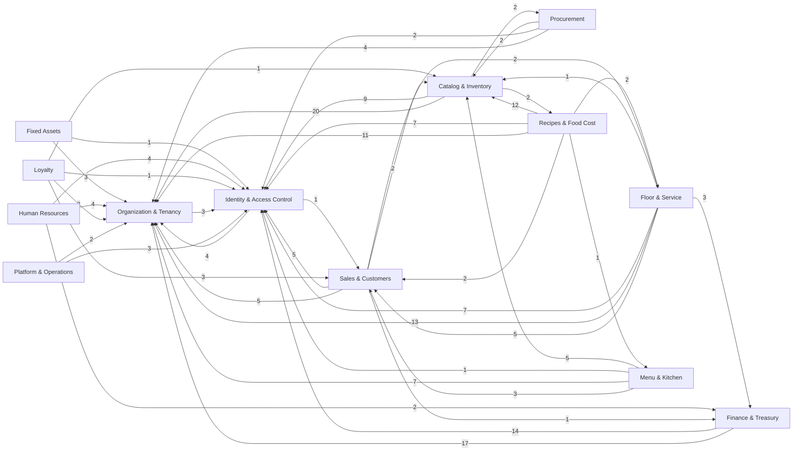

Edge labels count the foreign keys crossing between two domains. Nearly every domain points at *Organization & Tenancy* and *Identity & Access Control*: every record is scoped to a tenant and attributed to the user who created it.

## Organization & Tenancy

Every business record is scoped to an organization. Each outlet — café, restaurant or bar — is a branch with its own service styles; stores are org-level warehouses used by the optional Store → POS workflow.

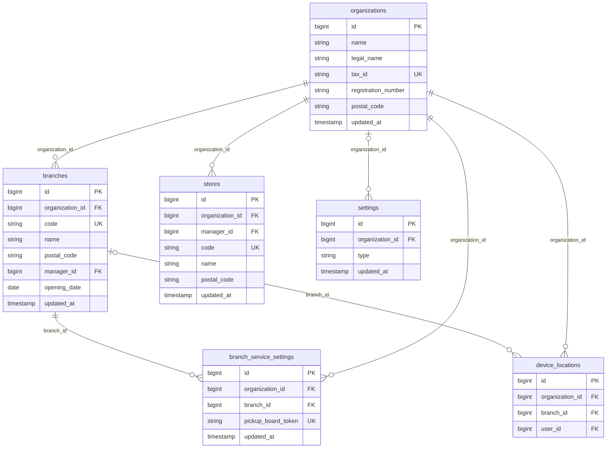

*Omitted for readability:* every table here also references `organizations` for tenancy, and `users` for attribution via `manager_id`, `user_id`.

## Identity & Access Control

Users, role-based permissions (Spatie model: roles are organization-scoped), 2FA trusted devices, and per-user read receipts.

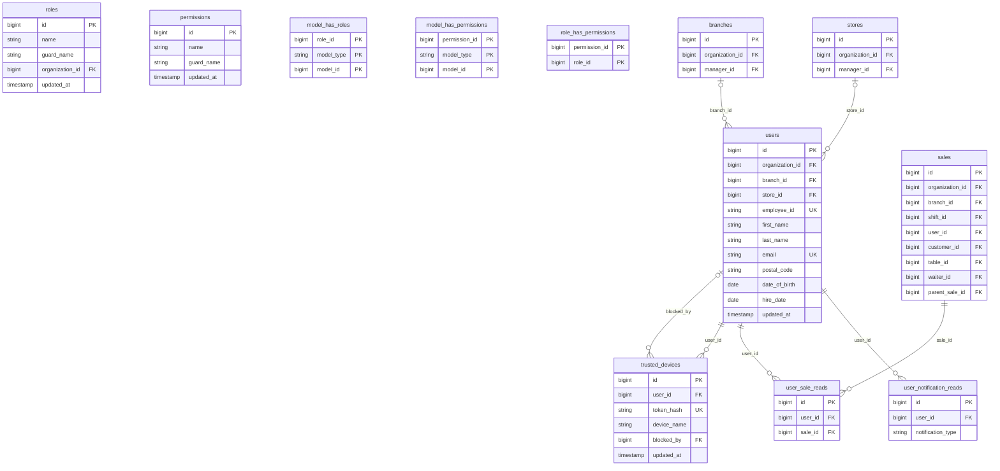

## Catalog & Inventory

Items and their per-branch / per-store stock, with every movement (adjustment, request, receipt, transfer) recorded as its own document with line items.

```mermaid
erDiagram
    items {
        bigint id PK
        bigint organization_id FK
        bigint category_id FK
        bigint manufacturer_id FK
        string sku UK
        string barcode UK
        string name
        enum type
        enum item_type
        bigint base_unit_id FK
        bigint cost_unit_id FK
        timestamp updated_at
    }
    categories {
        bigint id PK
        bigint organization_id FK
        bigint parent_id FK
        string code UK
        string name
        timestamp updated_at
    }
    manufacturers {
        bigint id PK
        bigint organization_id FK
        string code UK
        string name
        timestamp updated_at
    }
    item_stocks {
        bigint id PK
        bigint item_id FK
        bigint branch_id FK
        int quantity
        int store_quantity
        int reserved_quantity
        int available_quantity
        timestamp last_updated_at
        timestamp updated_at
    }
    store_stocks {
        bigint id PK
        bigint store_id FK
        bigint item_id FK
        int quantity
        int reserved_quantity
        int available_quantity
        timestamp last_updated_at
        timestamp updated_at
    }
    stock_adjustments {
        bigint id PK
        bigint organization_id FK
        bigint branch_id FK
        bigint store_id FK
        bigint item_id FK
        bigint adjusted_by FK
        string adjustment_number
        date adjustment_date
        enum adjustment_type
        int quantity_before
        int adjustment_quantity
        int quantity_after
        string reference_number
        timestamp updated_at
    }
    stock_requests {
        bigint id PK
        bigint organization_id FK
        bigint branch_id FK
        bigint store_id FK
        bigint requested_by FK
        bigint reviewed_by FK
        string request_number
        enum status
        timestamp updated_at
    }
    stock_request_items {
        bigint id PK
        bigint stock_request_id FK
        bigint item_id FK
        int requested_quantity
        timestamp updated_at
    }
    goods_receipts {
        bigint id PK
        bigint organization_id FK
        bigint branch_id FK
        bigint store_id FK
        bigint purchase_order_id FK
        bigint received_by FK
        bigint approved_by FK
        string receipt_number
        date received_date
        enum status
        timestamp updated_at
    }
    goods_receipt_items {
        bigint id PK
        bigint goods_receipt_id FK
        bigint purchase_order_item_id FK
        bigint item_id FK
        int received_quantity
        timestamp updated_at
    }
    stock_unit_transfers {
        bigint id PK
        bigint organization_id FK
        bigint branch_id FK
        bigint sent_by FK
        bigint accepted_by FK
        string transfer_number
        enum status
        timestamp updated_at
    }
    stock_unit_transfer_items {
        bigint id PK
        bigint stock_unit_transfer_id FK
        bigint item_id FK
        int quantity
        timestamp updated_at
    }
    branch_transfers {
        bigint id PK
        bigint organization_id FK
        bigint from_branch_id FK
        bigint from_store_id FK
        bigint to_branch_id FK
        bigint sent_by FK
        bigint received_by FK
        string transfer_number
        enum status
        timestamp updated_at
    }
    branch_transfer_items {
        bigint id PK
        bigint branch_transfer_id FK
        bigint item_id FK
        int quantity
        timestamp updated_at
    }
    branches {
        bigint id PK
        bigint organization_id FK
        bigint manager_id FK
    }
    purchase_order_items {
        bigint id PK
        bigint purchase_order_id FK
        bigint item_id FK
    }
    purchase_orders {
        bigint id PK
        bigint organization_id FK
        bigint branch_id FK
        bigint store_id FK
        bigint supplier_id FK
        bigint stock_request_id FK
        bigint created_by FK
        bigint approved_by FK
    }
    stores {
        bigint id PK
        bigint organization_id FK
        bigint manager_id FK
    }
    units {
        bigint id PK
        bigint organization_id FK
    }
    units |o--o{ items : "base_unit_id"
    categories |o--o{ items : "category_id"
    units |o--o{ items : "cost_unit_id"
    manufacturers |o--o{ items : "manufacturer_id"
    categories |o--o{ categories : "parent_id"
    branches ||--o{ item_stocks : "branch_id"
    items ||--o{ item_stocks : "item_id"
    items ||--o{ store_stocks : "item_id"
    stores ||--o{ store_stocks : "store_id"
    branches |o--o{ stock_adjustments : "branch_id"
    items ||--o{ stock_adjustments : "item_id"
    stores |o--o{ stock_adjustments : "store_id"
    branches ||--o{ stock_requests : "branch_id"
    stores |o--o{ stock_requests : "store_id"
    items ||--o{ stock_request_items : "item_id"
    stock_requests ||--o{ stock_request_items : "stock_request_id"
    branches |o--o{ goods_receipts : "branch_id"
    purchase_orders ||--o{ goods_receipts : "purchase_order_id"
    stores |o--o{ goods_receipts : "store_id"
    goods_receipts ||--o{ goods_receipt_items : "goods_receipt_id"
    items ||--o{ goods_receipt_items : "item_id"
    purchase_order_items ||--o{ goods_receipt_items : "purchase_order_item_id"
    branches ||--o{ stock_unit_transfers : "branch_id"
    items ||--o{ stock_unit_transfer_items : "item_id"
    stock_unit_transfers ||--o{ stock_unit_transfer_items : "stock_unit_transfer_id"
    branches |o--o{ branch_transfers : "from_branch_id"
    stores |o--o{ branch_transfers : "from_store_id"
    branches ||--o{ branch_transfers : "to_branch_id"
    branch_transfers ||--o{ branch_transfer_items : "branch_transfer_id"
    items ||--o{ branch_transfer_items : "item_id"
```

*Omitted for readability:* every table here also references `organizations` for tenancy, and `users` for attribution via `accepted_by`, `adjusted_by`, `approved_by`, `received_by`, `requested_by`, `reviewed_by`, `sent_by`.

## Procurement

Suppliers and purchase orders with an approval workflow and payment tracking.

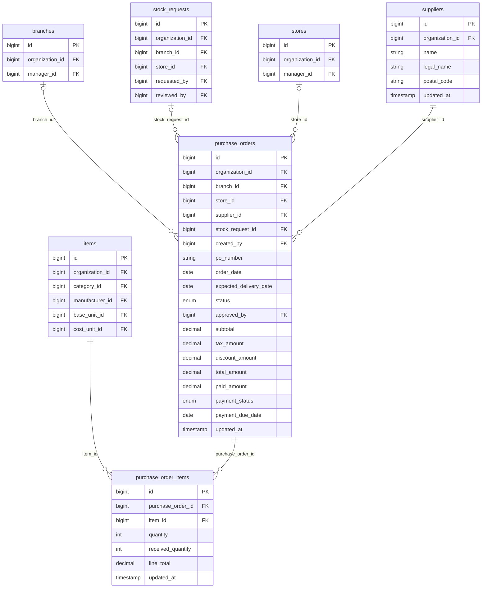

*Omitted for readability:* every table here also references `organizations` for tenancy, and `users` for attribution via `approved_by`, `created_by`.

## Sales & Customers

Point-of-sale transactions and credit (on-account) sales with instalment collection.

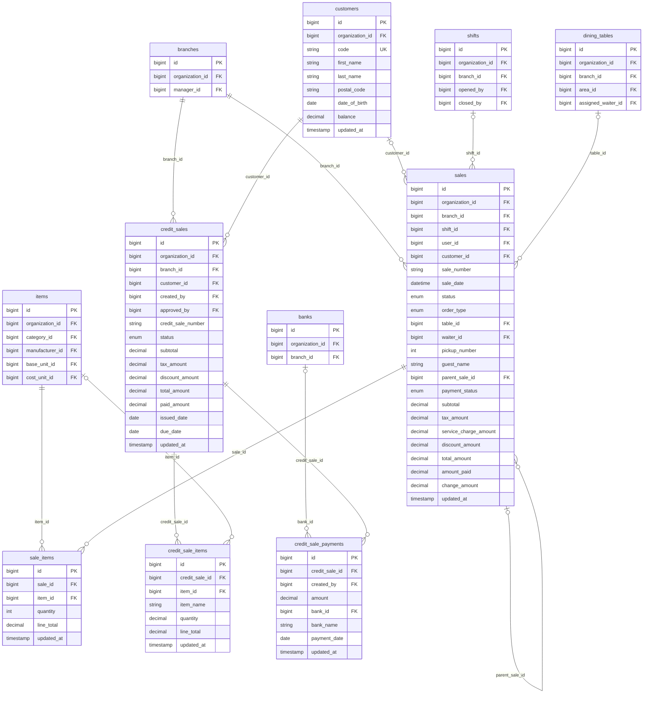

*Omitted for readability:* every table here also references `organizations` for tenancy, and `users` for attribution via `approved_by`, `created_by`, `user_id`, `waiter_id`.

## Finance & Treasury

Bank and mobile-wallet accounts with a transaction ledger, payment methods mapped to settlement accounts, inter-account transfers, expenses (one-off and recurring) and loans.

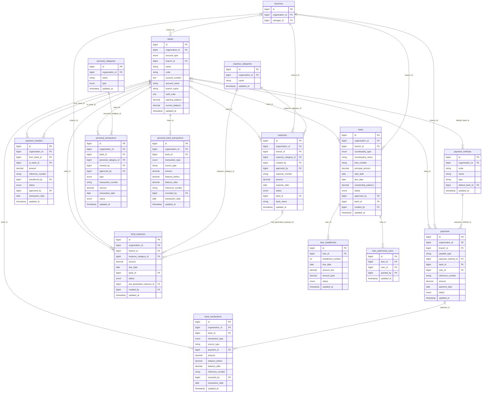

*Omitted for readability:* every table here also references `organizations` for tenancy, and `users` for attribution via `approved_by`, `created_by`, `granted_by`, `recorded_by`, `transferred_by`, `user_id`.

## Human Resources

Employees and payroll runs with per-employee payroll lines.

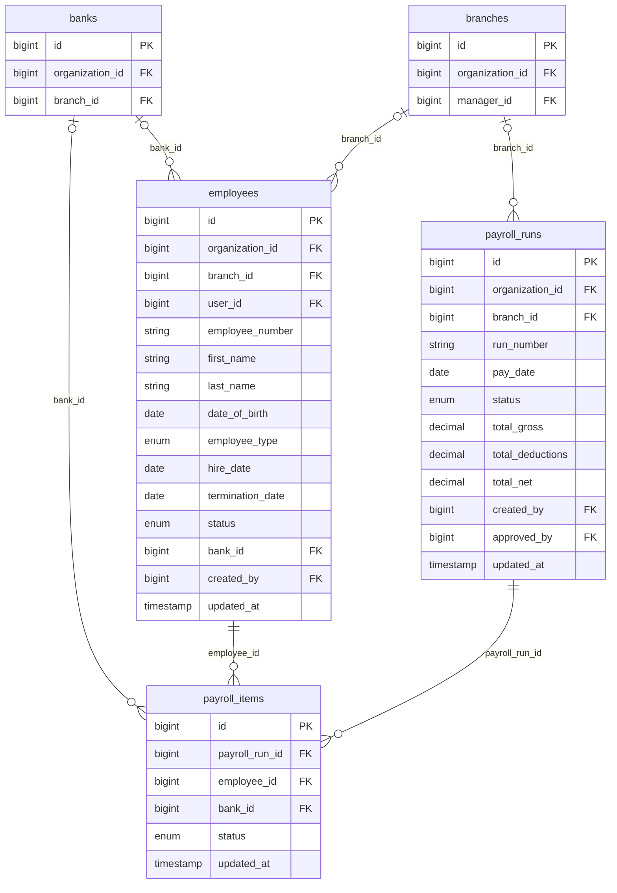

*Omitted for readability:* every table here also references `organizations` for tenancy, and `users` for attribution via `approved_by`, `created_by`, `user_id`.

## Fixed Assets

Asset register with categories and unique serial numbers.

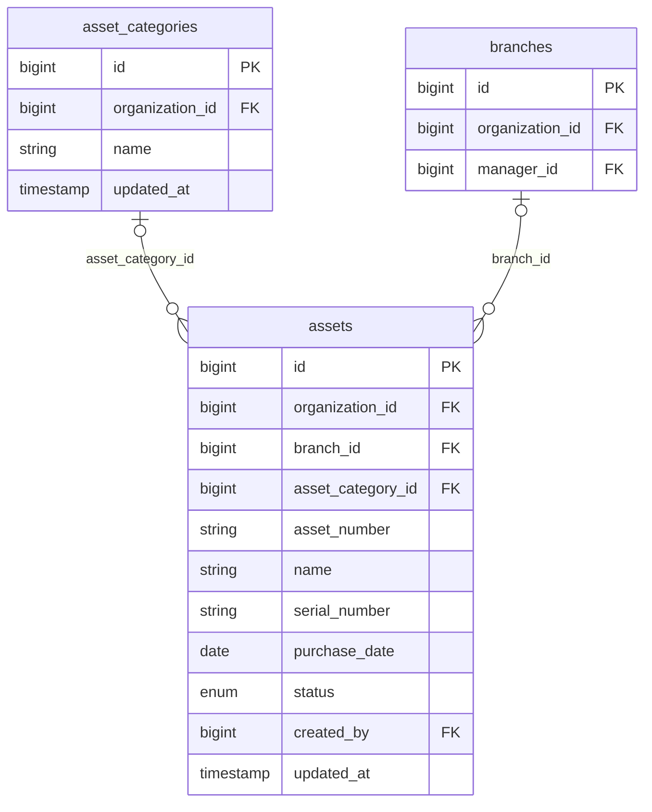

*Omitted for readability:* every table here also references `organizations` for tenancy, and `users` for attribution via `created_by`.

## Floor & Service

Areas and tables, the order lifecycle (open tickets, voids, discounts and comps with reasons, tips), shifts with cash-up, and the per-branch service styles: table service, counter service and bar tabs.

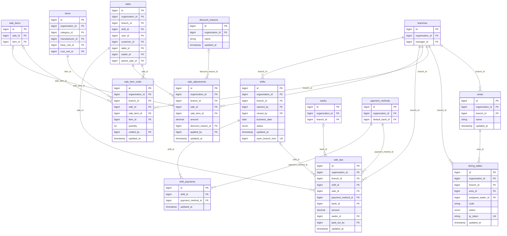

*Omitted for readability:* every table here also references `organizations` for tenancy, and `users` for attribution via `applied_by`, `assigned_waiter_id`, `closed_by`, `opened_by`, `paid_out_by`, `voided_by`, `waiter_id`.

## Menu & Kitchen

Menus with sections and time windows, modifier groups (sizes, extras), kitchen and bar stations, and kitchen order tickets (KOTs) that route each line to its station display.

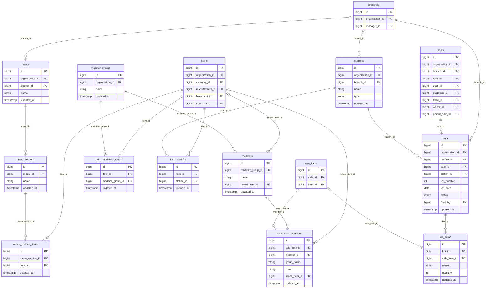

*Omitted for readability:* every table here also references `organizations` for tenancy, and `users` for attribution via `fired_by`.

## Recipes & Food Cost

Units of measure and conversions, recipes whose ingredients are consumed when a dish is sold, production (butchery, bulk prep) with yield, stock counts with variance, and wastage.

```mermaid
erDiagram
    units {
        bigint id PK
        bigint organization_id FK
        string name
        timestamp updated_at
    }
    unit_conversions {
        bigint id PK
        bigint organization_id FK
        bigint item_id FK
        bigint from_unit_id FK
        bigint to_unit_id FK
        timestamp updated_at
    }
    recipes {
        bigint id PK
        bigint organization_id FK
        bigint menu_item_id FK
        bigint yield_unit_id FK
        timestamp updated_at
    }
    recipe_items {
        bigint id PK
        bigint recipe_id FK
        bigint ingredient_item_id FK
        bigint unit_id FK
        timestamp updated_at
    }
    recipe_consumptions {
        bigint id PK
        bigint organization_id FK
        bigint branch_id FK
        bigint sale_id FK
        bigint sale_item_id FK
        bigint sale_item_modifier_id FK
        bigint ingredient_item_id FK
        int quantity
        timestamp updated_at
    }
    production_batches {
        bigint id PK
        bigint organization_id FK
        bigint branch_id FK
        string batch_number
        date business_date
        enum status
        bigint created_by FK
        bigint posted_by FK
        timestamp updated_at
    }
    production_inputs {
        bigint id PK
        bigint production_batch_id FK
        bigint item_id FK
        int quantity
        decimal total_cost
        bigint stock_adjustment_id FK
        timestamp updated_at
    }
    production_outputs {
        bigint id PK
        bigint production_batch_id FK
        bigint item_id FK
        int quantity
        bigint stock_adjustment_id FK
        timestamp updated_at
    }
    stock_counts {
        bigint id PK
        bigint organization_id FK
        bigint branch_id FK
        string name
        enum status
        bigint created_by FK
        bigint counted_by FK
        bigint approved_by FK
        timestamp updated_at
    }
    stock_count_lines {
        bigint id PK
        bigint stock_count_id FK
        bigint item_id FK
        bigint stock_adjustment_id FK
        timestamp updated_at
    }
    wastage_records {
        bigint id PK
        bigint organization_id FK
        bigint branch_id FK
        bigint shift_id FK
        bigint item_id FK
        date business_date
        int quantity
        decimal total_cost
        bigint sale_item_void_id FK
        enum status
        bigint recorded_by FK
        bigint approved_by FK
        bigint stock_adjustment_id FK
        timestamp updated_at
    }
    branches {
        bigint id PK
        bigint organization_id FK
        bigint manager_id FK
    }
    items {
        bigint id PK
        bigint organization_id FK
        bigint category_id FK
        bigint manufacturer_id FK
        bigint base_unit_id FK
        bigint cost_unit_id FK
    }
    sale_item_modifiers {
        bigint id PK
        bigint sale_item_id FK
        bigint modifier_id FK
        bigint linked_item_id FK
    }
    sale_item_voids {
        bigint id PK
        bigint organization_id FK
        bigint branch_id FK
        bigint sale_id FK
        bigint sale_item_id FK
        bigint item_id FK
        bigint voided_by FK
    }
    sale_items {
        bigint id PK
        bigint sale_id FK
        bigint item_id FK
    }
    sales {
        bigint id PK
        bigint organization_id FK
        bigint branch_id FK
        bigint shift_id FK
        bigint user_id FK
        bigint customer_id FK
        bigint table_id FK
        bigint waiter_id FK
        bigint parent_sale_id FK
    }
    shifts {
        bigint id PK
        bigint organization_id FK
        bigint branch_id FK
        bigint opened_by FK
        bigint closed_by FK
    }
    stock_adjustments {
        bigint id PK
        bigint organization_id FK
        bigint branch_id FK
        bigint store_id FK
        bigint item_id FK
        bigint adjusted_by FK
    }
    units ||--o{ unit_conversions : "from_unit_id"
    items |o--o{ unit_conversions : "item_id"
    units ||--o{ unit_conversions : "to_unit_id"
    items ||--o{ recipes : "menu_item_id"
    units |o--o{ recipes : "yield_unit_id"
    items ||--o{ recipe_items : "ingredient_item_id"
    recipes ||--o{ recipe_items : "recipe_id"
    units |o--o{ recipe_items : "unit_id"
    branches ||--o{ recipe_consumptions : "branch_id"
    items ||--o{ recipe_consumptions : "ingredient_item_id"
    sales ||--o{ recipe_consumptions : "sale_id"
    sale_items ||--o{ recipe_consumptions : "sale_item_id"
    sale_item_modifiers |o--o{ recipe_consumptions : "sale_item_modifier_id"
    branches ||--o{ production_batches : "branch_id"
    items ||--o{ production_inputs : "item_id"
    production_batches ||--o{ production_inputs : "production_batch_id"
    stock_adjustments |o--o{ production_inputs : "stock_adjustment_id"
    items ||--o{ production_outputs : "item_id"
    production_batches ||--o{ production_outputs : "production_batch_id"
    stock_adjustments |o--o{ production_outputs : "stock_adjustment_id"
    branches ||--o{ stock_counts : "branch_id"
    items ||--o{ stock_count_lines : "item_id"
    stock_adjustments |o--o{ stock_count_lines : "stock_adjustment_id"
    stock_counts ||--o{ stock_count_lines : "stock_count_id"
    branches ||--o{ wastage_records : "branch_id"
    items ||--o{ wastage_records : "item_id"
    sale_item_voids |o--o{ wastage_records : "sale_item_void_id"
    shifts |o--o{ wastage_records : "shift_id"
    stock_adjustments |o--o{ wastage_records : "stock_adjustment_id"
```

*Omitted for readability:* every table here also references `organizations` for tenancy, and `users` for attribution via `approved_by`, `counted_by`, `created_by`, `posted_by`, `recorded_by`.

## Loyalty

Stamp-card loyalty programs: which items earn a stamp, each guest card, and every earn and redeem event.

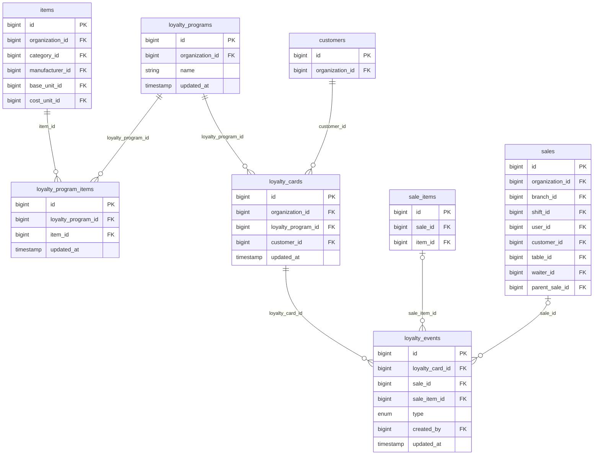

*Omitted for readability:* every table here also references `organizations` for tenancy, and `users` for attribution via `created_by`.
## Platform & Operations

Audit trail, operational alerts, asynchronous report exports and controlled database restores.

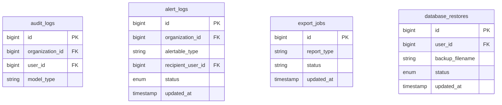

*Omitted for readability:* every table here also references `organizations` for tenancy, and `users` for attribution via `recipient_user_id`, `user_id`.

