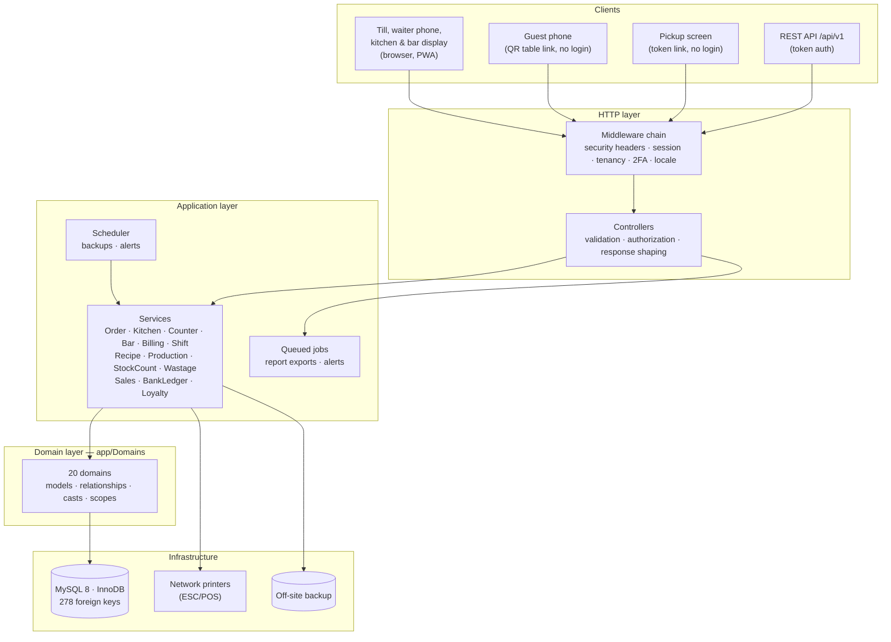
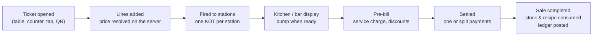

# Architecture

HOROOPLATE is a modular monolith: one deployable Laravel application, organized internally into
bounded domains that own their models and rules. It began as a fork of HOROOMART, HOROO
Innovations' business management platform, and keeps its tenancy, security, finance,
procurement, inventory, HR and reporting core. The restaurant features are built on top of that
core, not beside it. A single application server and one MySQL database carry a multi-outlet
venue.

## Layered structure

**Controllers** stay thin: they validate, authorize against a permission and delegate.
**Services** own every multi-step operation that must be atomic — anything touching stock,
money or a ticket — and run inside database transactions. **Domain models**
own relationships, casts (including encryption at rest) and query scopes.

## Domains

| Domain | Responsibility |
|---|---|
| **Organization** | Tenants, branches (each café, restaurant or bar outlet), stores (warehouses), settings |
| **User** | Users, roles (standard and organization-specific) and permissions, trusted devices |
| **Restaurant** | Areas and tables, tickets, voids, discounts and comps, tips, shifts, service styles per branch |
| **Kitchen** | Stations, kitchen order tickets (KOTs), the kitchen and bar displays, ticket printing |
| **Menu** | Menus and sections, time windows and price overrides, modifiers, units, recipes, production |
| **Inventory** | Items, per-location stock, stock counts, wastage, every stock movement document |
| **Billing** | Pre-bills, service charge, splitting and settling a ticket |
| **Loyalty** | Stamp-card programs, guest cards, earn and redeem events |
| **Sales** | Completed sales, credit (on-account) sales and their collection |
| **Financial** | Banks and wallets, the account ledger, payment methods and expenses |
| **Procurement** / **Supplier** | Suppliers, purchase orders, receiving, payment status |
| **Customer** | Guest and customer records (phone number encrypted at rest) |
| **HR** / **Loans** / **Assets** | Staff and payroll, loans, the fixed-asset register |
| **Alerts** / **Reports** / **AI** / **Shared** | Notifications, asynchronous exports, demand forecasting, the audit log |

The complete schema is in [../database/SCHEMA.md](../database/SCHEMA.md), with one diagram per
domain in [../database/ERD.md](../database/ERD.md).

## One organization, several outlets

A venue group is one **organization**. Each outlet — the café, the restaurant, the bar — is a
**branch**, and each branch switches on the service styles it uses:

| Service style | How it works |
|---|---|
| **Table service** | A waiter opens a ticket at a table, adds lines, sends them to the kitchen, prints a pre-bill, and settles or splits it. |
| **Counter service** | The guest pays first and collects by number; a pickup screen shows what is ready. |
| **Bar tabs** | A named tab runs through the evening, with a spending limit that a supervisor can raise. |
| **QR ordering** | A guest scans the table's code and orders from their phone; staff confirm before anything reaches the kitchen. |

Menus, stations, stock counts and wastage belong to a branch. Stock can be bought centrally
into a **store** and issued to outlets by transfer, so every bottle that reaches a bar has an
auditable path.

## The order lifecycle

Each step is a service call inside a transaction. A line removed after it was fired is a
recorded **void**, not a deletion. Settling a ticket completes one sale, posts every non-cash
payment to its account, consumes stock — the item's own for a bottle, the recipe's ingredients
for a dish.

## Stock that follows the recipe

Restaurant stock is not a shop's plus and minus. An item is one of three kinds:

| Kind | Examples | What selling it does |
|---|---|---|
| **Stock item** | bottled beer, soft drinks, a cake bought in | takes one off its own stock |
| **Made from a recipe** | a cappuccino, tibs, a cocktail | takes each ingredient off, in the ingredient's own unit, and records what it cost at that moment |
| **Service** | delivery, corkage | nothing |

Ingredients are held in their smallest practical unit (g, ml, piece), and a unit-conversion graph
lets a recipe say "30 ml" of a spirit bought by the 750 ml bottle, or a store receive "3 crates"
of a beer that comes 24 to the crate. **Production** turns bought stock into prepared stock with
a yield (a carcass into cuts, bulk sauce into portions); **stock counts** compare the shelf with
the book; **wastage** is recorded with a reason and approved separately.

## Multi-tenancy

Shared-database, row-level tenancy. Every business table carries `organization_id`, backed by a
real foreign key.

- Middleware rejects any authenticated request from a user not bound to an organization, and
  binds operational users to their branch.
- A shared query scope restricts operational data to the user's own branch or store unless
  their role grants organization-wide visibility.
- Document numbers are unique **per organization**.
- Roles can belong to an organization, so a tenant can define its own roles alongside the
  standard ones (Waiter, Cashier, Supervisor, Head Chef, Branch Manager and so on).

## Request lifecycle

The `web` middleware group runs in a deliberate, test-locked order: security headers →
session and CSRF → organization security settings → locale (English, Amharic, Afaan Oromoo) →
branch, then organization guards → two-factor verification → forced password change. Before
all of these, the request's host is checked against the configured application hosts. An
automated test asserts the ordering, because reordering middleware is a classic source of
silent security regressions.

## Background processing

| Mechanism | Used for |
|---|---|
| **Scheduler** | Daily database backup with 14-day retention · daily verification of the off-site copy · due-date alerts · purchase-order payment reconciliation |
| **Queued jobs** | Report exports (PDF, Excel, CSV) and alert delivery |
| **Operational alerting** | A failed backup or a failed off-site check alerts administrators the same day |

## Integrations

| Integration | Purpose |
|---|---|
| **Network printers** (ESC/POS over TCP) | Kitchen and bar tickets on the venue's own network |
| **REST API** (`/api/v1`, per-user tokens) | Catalogue, sale creation, analytics |
| **Mobile money** | Wallet accounts (e.g. Telebirr) are first-class settlement accounts |
| **Email (SMTP)**, **WhatsApp** | Receipts, password resets, alerts |
| **SFTP** | Off-site backup replication |

## Frontend

Server-rendered Blade templates with Alpine.js (the CSP-compatible build, so the Content
Security Policy needs no `unsafe-eval`) and Tailwind CSS, bundled by Vite. The application is
installable as a **Progressive Web App**, built phone-first for waiters and bar staff. Checkouts
that fail for lack of connectivity are queued on the device and replayed on reconnect; the
checkout's idempotency key makes a replay of an already-recorded sale a harmless no-op.

## Known design boundaries

- **Account ledger, not a general ledger.** Money is tracked as running balances per bank, wallet
  and cash account with a full transaction trail. There is no chart of accounts or double-entry
  journal. See [FINANCIAL_INTEGRITY.md](FINANCIAL_INTEGRITY.md).
- **Single-region, single-database.** Scaling is vertical plus caching; horizontal sharding is
  not a goal.
- **Whole-number stock.** Stock quantities are integers in each item's base unit, which is why
  ingredients are held in grams and millilitres rather than kilograms and litres.
