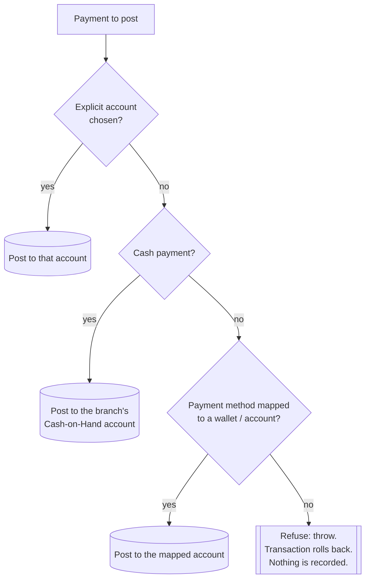

# Financial Integrity

Money is where business software most often fails quietly: a payment recorded against no
account, a double-posted retry, a balance drifting from its own history. HOROOPLATE's finance
layer is built around one rule, enforced in a single place:

> **Every money movement posts to an account ledger inside the same database transaction, or
> the whole operation fails.**

## The account ledger

Each organization holds **accounts** of three kinds:

| Kind | Examples |
|---|---|
| Bank account | A commercial bank current account |
| Mobile wallet | Telebirr and similar mobile-money wallets |
| Cash on hand | One per branch, created automatically |

Every change to an account's balance is a row in `bank_transactions`, and each row records:

- direction (`credit` / `debit`) and amount
- **`balance_before` and `balance_after`**, so any single row shows the balance at that instant
- the **source document** (`source_type` + `source_id`) — the sale, payment, expense, payroll
  run or transfer that caused it
- who recorded it, when, and a reference number
- an optional **idempotency key**

Because every row carries its own before/after balance, the ledger is self-auditing. Any
account's balance at any past date can be read directly, and the stored current balance can
be recomputed from its history and compared.

## One entry point for every posting

Sales, credit-sale collections, purchase-order payments, expenses and payroll all post through
a single service method. It resolves **which account** a payment lands in, in a fixed order:

The final branch is the point of the design. A non-cash payment that cannot be matched to an
account is **rejected** rather than recorded without a ledger entry. Before this rule was
centralized, each payment path had its own posting logic, and paths drifted. Consolidating them
into one method, with the refusal built in, removed that class of bug rather than one
instance of it.

Direction is validated too: anything other than `credit` or `debit` throws. A typo in
money-moving code must fail loudly, never fall through to a default.

## Concurrency: locked balances

A posting runs inside the caller's database transaction and takes a **row lock** on the account
(`SELECT … FOR UPDATE`) before reading its balance. Two cashiers settling to the same wallet at
the same moment are serialized. Neither can read a stale balance, so neither overwrites the
other's update.

The same pattern protects stock quantities, approvals and document-number generation. Tests
prove each lock actually executes, and load tests exercise real parallel contention (see
[ENGINEERING_PRACTICES.md](ENGINEERING_PRACTICES.md#concurrency-control)).

## Idempotency: safe retries

Point-of-sale networks drop. Users double-tap. The offline queue replays. HOROOPLATE assumes all
three will happen:

- A POS checkout carries a client-generated **idempotency key**. The `sales` table has a
  unique constraint on it per organization, so a replayed checkout returns the original sale
  instead of creating a second one.
- Payments, credit-sale collections, account transfers, stock adjustments and ledger
  postings carry idempotency keys too. Each write first checks for an existing record under
  its key and returns it instead of writing again.

The result: **retrying any money-moving request is always safe.**

## Server-side pricing

The client never tells the server what something costs. On checkout the server resolves each
line's price itself (the live menu's price for that item and time, plus any modifier such as a
size or an extra) and recomputes line totals, tax and the sale total. The tax rate comes from
the organization's settings, never from the till. Price and tax fields in the request are
ignored. This closes the "edit the price in the browser"
attack, and it keeps the displayed price and the charged price identical.

## Immutability of finalized records

Once a financial record is final, it cannot be edited:

| Record | Locked once |
|---|---|
| Sale | completed |
| Credit sale | confirmed |
| Expense | approved |
| Recurring expense | cancelled |
| Loan | approved or rejected (status can't be reset through an edit) |

Corrections are made with new, attributable records (a reversal, a refund, an adjustment),
never by rewriting history. Each rule has an automated test that attempts the forbidden edit
and asserts it is refused.

## Approval and segregation of duties

Purchase orders, goods receipts, account-to-account transfers, loans, expenses, credit
sales and payroll follow approval workflows, and **the creator of a record cannot approve
it**. The check is enforced in code through a shared guard, not left to role configuration.
Approval actions are also concurrency-guarded, so two approvers acting at once can't both
succeed.

## Revenue and cost recognition

- **Cash sales** count as revenue when completed.
- **Credit sales** count **on a cash basis**: an invoice contributes revenue only as payments
  are collected. A partial payment contributes a **prorated** share of each line item, so
  item-level reports (top products, category breakdown, margin) stay accurate for partly-paid
  invoices.
- **Cost of goods sold** is **point-in-time**. Each sold item is costed at what it actually
  cost when it was sold, resolved from its purchase receipts, stock-in adjustments and recorded
  cost-price changes. A later price change never rewrites past margins. Live reports and their
  exported versions share one costing implementation, so they cannot disagree.

## Restaurant controls

A venue loses money in ways a shop does not: food sent back, drinks poured and not rung up,
cash drawers that don't balance at 2 a.m. Each has a control:

| Risk | Control |
|---|---|
| Cash drawer short or over | Every sale belongs to a **shift**. Closing it records the opening float, the cash expected from the shift's own sales, the cash counted, and the **variance**. The Z-report is kept. |
| A line removed after the kitchen made it | A **void** records who, when, the reason, and whether the item had already been fired to the kitchen. Voiding a fired item or a whole ticket needs its own permission. |
| Discounts and free items | **Discounts, comps and staff meals** are separate adjustments with a chosen reason and the user who applied them, reported on the manager's dashboard every day. |
| Stock that walks out | Selling a dish records the **ingredients its recipe consumed**, at their cost at that moment. Stock counts compare what should be on the shelf with what is, and wastage is recorded with a reason and approved separately. |
| Trading past midnight | A configurable **business day** keeps a late bar's night as one trading day for shifts, reports and the dashboard. |

## Detective controls

Preventive rules stop new problems. Detective controls find old ones:

- **Balance reconciliation.** An account's stored balance can be recomputed from its
  transaction history and corrected if the two have diverged.
- **Unposted-payment audit.** A read-only command lists any historical non-cash payment that
  has no ledger entry: which records, which dates, which amounts. It **does not** invent
  corrective entries. The report goes to a human (an accountant), who decides between posting
  exact corrections and a documented write-off.
- **Audit log.** Changes to business records are logged with the acting user, the old and
  new values, IP address, user agent and timestamp.

## Scope

This is an **account ledger** (running balances per bank, wallet and cash account) with full
transaction history, not a double-entry general ledger with a chart of accounts. It gives a
venue accurate cash positions, reconcilable balances and trustworthy profit
reporting. Formal accrual accounting, deferred revenue and statutory financial statements
belong in a general-ledger module. See [ARCHITECTURE.md](ARCHITECTURE.md#known-design-boundaries).
